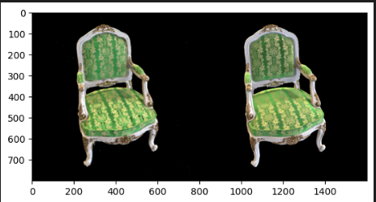

<div align="center">

# Gaussian Splatting

</div>


This repo is a reimplemntation of the Gaussian Splatting techniques as described in the paper https://repo-sam.inria.fr/fungraph/3d-gaussian-splatting/

The intent of this project is to better comprehend the Gaussian Splatting technique and to provide a nice and comprehensible interface for anyone who wants to learn the techniques involved or adapt the method.

This project was conducted by Joao Andreotti and Guilherme Vieira during the INF573 - Computer Vision of Ecole Polytechnique de Paris.

It is build on top of the Differential Gaussian Rasterizer (provided as a submodule) and of COLMAP (https://colmap.github.io/) to create SfM point clouds.

The rasterizer only works on CUDA devices, so make sure your machine has support for that.


## 📥 Installing
To install this library, you first need to pull the directory with its submodules:
```bash
git clone https://github.com/joao-andreotti/gaussian-splatting.git --recursive
cd gaussian-splatting
```

We recommend you to create a python venv to mnage the dependencies of this project, including the libraries. If you use another virtual environemnt manager, feel free to skip this part.
```bash
python3 -m venv venv                        # creates the venv
cp venv/bin/activate ./activate             # copies the activator in the local module
source activate                             # activates the environment
```

Now that you are inside your prefered environment, we install the project dependencies.

```bash
python setup.py install                     # install other dependencies

cd submodules/diff-gaussian-rasterization   # installing the rasterizer
python setup.py build
python setup.py install
cd ../..
```

Now you are all set to run scripts, notebooks and train models!


## 🗃 Datasets
We provide two ways of importing datasets into the rasterizer: via downloading the synthetic NERF datasets (https://paperswithcode.com/dataset/nerf) of via a video you can record from your phone. Lets go into detail on how to use both.

Keep in mind that for both approaches you need to have colmap installed on your machine. It is not necessary to have CUDA support at this time. Check https://colmap.github.io/install.html for more information on how to install it.


### From NeRF synthetic dataset
The first step is to download the dataset. This can be done via the link provided or via a provided script.
```bash
python scripts/download_synthetic.py [optional: directory_path]

# example
python scripts/download_synthetic.py ./data/
```

This will create a folder `nerf_synthetic` on your project with all the dataset inside in the `directory_path` directory. By default this is on `./data/`

Now we will extract the point cloud from one of these datasets.
For example, if the nerf dataset is under `./data/nerf_synthetic`

```bash
sh ./scripts/process_nerf.sh [nerf_files_path] [dataset_name] [output_path]

# example
sh ./scripts/process_nerf.sh ./data/nerf_synthetic/ chair ./data/my_chair
```

This will run COLMAP and output the Point Cloud information plus the relevant images in the `./data/my_chair` directory.


### From video data
Using video data is much simpler since we only need to sample video frames and extract SfM.
For this you'll need to run the following script.

```bash
sh ./scripts/process_video.sh  [video_path] [output_path] [sample_size]

# example
sh ./scripts/process_video.sh  ./data/my_video.mp4 ./data/my_data 100
```

This will extract the data from `100` sample frames from your video, extract the pointcloud via colmap and save everything under the `./data/my_data` directory.

## 🏋️‍♀️ Training
With a dataset in hands we can start to fit our own splattings!
For this there is a provided interactive notebook under `./notebooks/gaussian_splatting.ipynb`.

We also provide a script to train your Gaussian Splatting:
```bash
# for instructions on how to use it
python ./scripts/train.py -h

# example usage
python ./scripts/train.py ./data/cat/ ./models/cat.pkl --epochs=300
```

This will fit a model and save the trained parameters under `./models/cat.pkl`.

If you want more detail on how the colmap output can be parsed, refer to `examples/parsing_colmap.py`.


## 👁 Visualizing
In order to better visualize and understand the capacities and limitations of this technique, we have provided a GUI interface to play with a fitted gaussian model.

This is based on **TKinter** so make sure to have it properly installed (follow https://docs.python.org/3/library/tkinter.html) and that you have a display available (SSH connections to remote machines won't cut it...).

You can start visualizing via the provided command-line script:
```bash
# to view the model with a default camera
python ./scripts/gui.py ./model/cat.pkl

# to view the model starting from a random image from the dataset (recommended)
python ./scripts/gui.py ./model/cat.pkl --dataset ./data/cat/
```

This script should launch the tkinter GUI application to help you visualize the fitted model.


The script is only a demo. If you want to play with the parameters (camera position, background color, FoV, window size, ...) please refer to `./examples/gui[_from_image].py`.


## 🔜 Extensions
- Experiment with different learning rates for different parameters.
- Try different regularization techniques to get rid of floaters.

